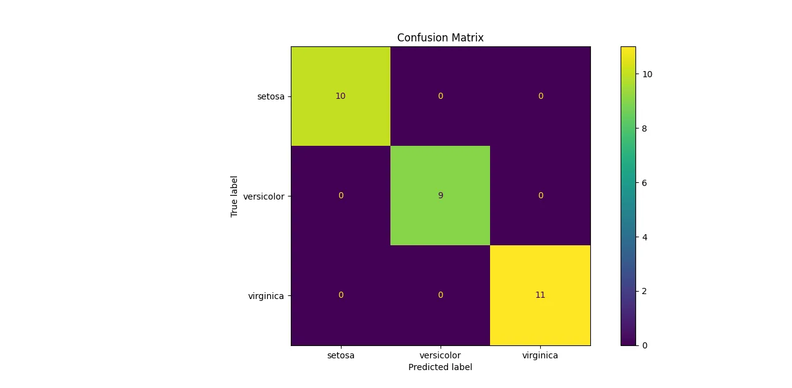

# AI Classification Project

## Overview

This project is a machine learning-based classification system that predicts output classes based on input data. It demonstrates the complete pipeline of an AI model including data preprocessing, model training, evaluation, and performance visualization.

The goal of this project is to build a simple but effective classification model and evaluate its performance using standard metrics such as accuracy and confusion matrix.

---

## Features

- Data loading and preprocessing
- Model training using machine learning algorithm(s)
- Model evaluation on test data
- Performance visualization using confusion matrix
- Prediction on new/unseen data

---

## Project Structure

```

ai-classification-project/
│
├── main.py                  # Main script to run the project
├── model.py                 # Model training and prediction logic
├── dataset.csv             # Dataset used for training/testing
├── confusion_matrix.webp   # Confusion matrix visualization
├── requirements.txt        # Required Python libraries
└── README.md               # Project documentation

```

---

## Installation

### Step 1: Clone the repository

```

git clone [https://github.com/mubashranoor04/ai-classification-project.git](https://github.com/mubashranoor04/ai-classification-project.git)
cd ai-classification-project

```

### Step 2: Install dependencies

```

pip install -r requirements.txt

```

---

## How to Run

### Step 1: Train and test the model

```

python main.py

```

This will:
- Load the dataset
- Train the model
- Evaluate performance
- Generate predictions

---

## Model Evaluation

The performance of the model is evaluated using a confusion matrix, which shows the number of correct and incorrect predictions for each class.

### Confusion Matrix



---

## Technologies Used

- Python
- Pandas
- NumPy
- Scikit-learn
- Matplotlib (if used for plotting)

---

## Results

The model performance is analyzed using:
- Accuracy score
- Confusion matrix
- Classification report (if included)

---

## Future Improvements

- Try different machine learning models
- Improve feature engineering
- Add hyperparameter tuning
- Deploy model using Flask or Streamlit
- Add real-time prediction interface

---

## Author

Mubashra Noor  
Computer Science Student  
AI and Machine Learning Enthusiast

GitHub: https://github.com/mubashranoor04
